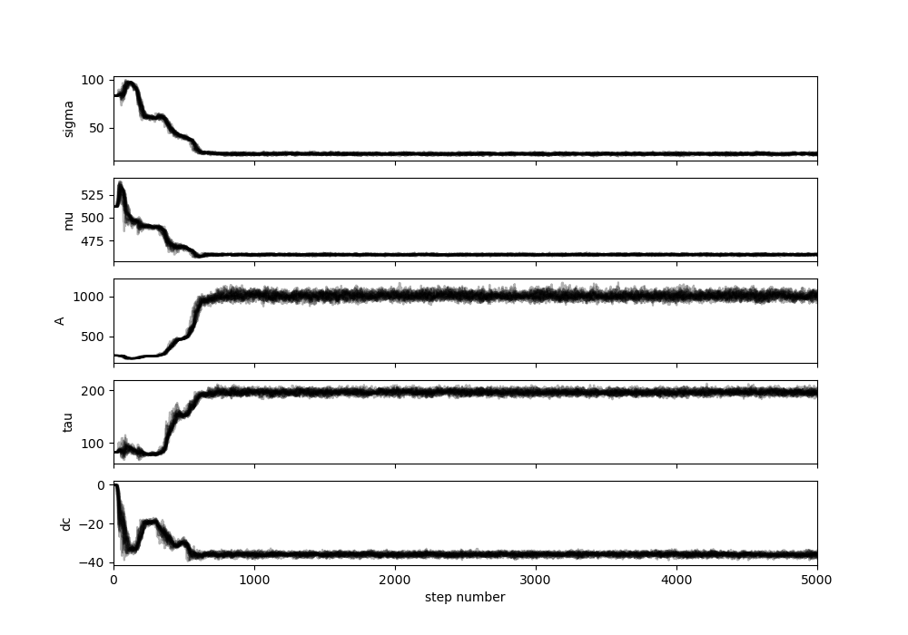
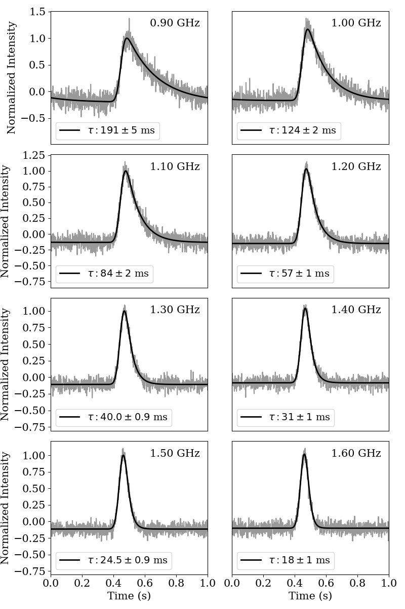
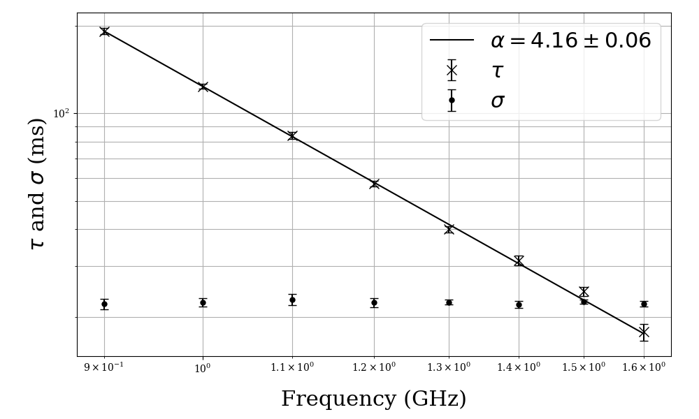

# SCAMP-I
Copyright &copy; 2021 Lucy Oswald and Marisa Geyer

Licensed under the Academic Free License version 3.0

Disclaimer: this program comes with ABSOLUTELY NO WARRANTY. You are free to modify and redistribute this code as long as you do not remove the above attribution and reasonably inform recipients that you have modified the original work.

## Citation
If using SCAMP-I contributes to a project that leads to a scientific publication, please cite the article:
"The Thousand-Pulsar-Array programme on MeerKAT - V. Scattering analysis of single-component pulsars".

## Introduction

SCAMP-I (**SCA**tter **M**odelling for **P**ulsars - **I**) is a collection of tools to perform time domain analysis of scattered single-component pulse profiles of pulsars. It uses Markov-chain Monte Carlo (MCMC) methods provided by the software package emcee to fit the train+DC model of a Gaussian convolved with a scattering transfer function (Geyer & Karastergiou 2016) to a scattered pulse profile. The input data required is a pulse profile, or a series of pulse profiles at different frequencies, all of which are modelled independently. The software uses the MCMC to converge on the 5 best fit parameters that describe the model: the amplitude, mean and standard deviation of the Gaussian, the characteristic scattering timescale tau, and any DC offset of the pulse profile from the baseline. The model is designed to be applicable to pulse profiles for which the scattering tail extends well beyond the pulse period. 

There are additional tools to analyse the MCMC output, save the best fit model parameters, and generate publication-quality plots demonstrating the results of the process. If multiple profiles are analysed at different frequencies, this includes calculating the scattering spectral index alpha that results from how the scattering timescale tau varies with frequency.

## Motivation and applicability

This software was developed in order to analyse the scattered single-component pulsars observed with the MeerKAT telescope (Oswald et al 2021). Its origins lie in the model developed by Geyer & Karastergiou (2016). It is technically possible to apply the software to any pulse profile, however the user is cautioned to be aware of the cases under which the results of the modelling will be most reliable. The model assumes that the intrinsic pulse profile can be described by a single Gaussian. This means the modelling is only relevant for single-component pulsars. Furthermore, weakly scattered pulsars are less likely to be accurately modelled, since the impact of any asymmetry in the intrinsic profile shape will have a greater comparative effect for pulsars with small scattering timescales (see Oswald et al 2021 for details). The software includes an inbuilt convergence criterion for the MCMC chains, but analysis of modelling accuracy for a given pulse profile ultimately requires the judgement of the user.

## Data use cases

This software is designed to do time domain modelling on pulse profiles which are:

* Single component (since the model intrinsic profile is a single Gaussian)
* Sufficiently scatter broadened (see Oswald et al 2021 for in details, but a good rule of thumb is that the profile shape is visibly scatter broadened)
* Broad-band (the software will produce a fit for a single pulse profile, but the tools have been designed to compare how scattering evolves with frequency)

## Usage

The software is intended to be used for some or all of the following steps:

1. Fit a time-domain single-component scattered model to one or more pulse profiles
2. Save the results of these fits in terms of best fit parameters with uncertainties
3. Fit a power law to scattering timescale across frequency
4. From this fit extract alpha and a characteristic scattering timescale scaled to 1 GHz

The software is designed to be modular for flexibility. Users may wish to apply the software to a single pulse profile, in which case the latter 2 steps would be irrelevant. The nature of MCMC modelling is that the definition of the best fit parameters is to some extent subjective. The model fitting is therefore separate from the extraction of best fit parameters and the user is welcome to apply alternative methods to identify these parameters from the saved MCMC chains.

Interaction with the tools is done via command line arguments. For details of these for a given script, run that script with argument “-h”. 

## Installation

The software is written in **python3** and requires the following dependencies, all of which are available by pip install:

* emcee (for the MCMC)
* corner (for the corner plots)
* lmfit (to fit for a DM correction)
* tqdm (optional: for the progress bar showing how much the MCMC run has progressed. This is only required if the command line option “--showprogress” is enabled for run_scatter_mcmc.py, or for alpha_mcmc.py)

To use this software, download the source code and ensure that its parent directory is added to your python path. This can be done by adding the following to your bashrc/zshrc:

```bash
export MYCODE=path/to/parent/directory/ 
export PYTHONPATH=$PYTHONPATH:$MYCODE
```

You may also find it useful to add the following line of code in the bashrc/zshrc in order to be able to easily locate the software:

```bash
export SCATTERMC=$MYCODE/SCAMP-I
```

N.B. if you use csh rather than bash, the equivalent command to "export" in your cshrc is "setenv".

## Example

Within the SCAMP-I directory there is a directory labelled test_example. 

This contains:

* simpsr.ascii (simulated data, saved as an ascii file)
* simpsr_config.csv (a config file to accompany the data)
* examplerun.sh (a script containing instructions to apply the modelling to the simulated data file)

Running examplerun.sh will generate the same output as described in this example. 

To test this, copy these three files to the directory location of your choice (the three files must all be placed into the same directory so that they can locate each other correctly). Ensure that you have added the software parent directory to your python path and that the dependencies are installed, all as described above under “Installation”. Then run the following command in your terminal:

```bash
bash examplerun.sh
```
N.B. the commands in examplerun.sh are not dependent on bash and so the script could equivalently be run in csh with no problems.

Two subdirectories will be created: “logs” and “output”. Then the following scripts will be run in order:

* run_scatter_mcmc.py (fits the model to each of the pulse profiles and saves the MCMC chains as a .h5 file under output/chains)
* check_tau_chains.py (loads in the MCMC chains and creates diagnostic plots, which are saved under output/diagnostic_plots/)
* define_tau_passfail_burnin.py (prompts the user to check the diagnostic plots and then interact via the command line to discard failed runs and specify the required burn-in fraction for further analysis of the chains)
* parameter_extraction.py (applies the burn-in to the successful MCMC runs and then calculates and saves the best fit model parameters under output/results)
* alpha_mcmc.py (fits a power law across frequency to the scattering timescales obtained in the previous step. MCMC chains also saved as a .h5 file under output/chains)
* check_alpha_chains.py (as for check_tau_chains.py, but now for the power law MCMC fit)
* define_alpha_burnin.py (as for define_tau_passfail_burnin.py, but only with the option to specify burn-in fraction)
* best_fit_alpha_tau.py (obtains the best fit values for alpha and for the characteristic scattering timescale scaled to 1 GHz)
* basic_plotting.py (creates plots and saves them to output/results/plots. NB the pulse profile plotting is formatted into a grid assuming exactly 8 profiles. It will work sufficiently well as a diagnostic plot for more or fewer profiles, but may not be appropriate for publications.)

The results of this process are saved under output/results/. The best fit parameters are saved into a csv file, and plots are saved as png files. The MCMC chains are saved under output/chains/. This means that any step of the analysis post-MCMC can be repeated using the same chains. 

This is an example of a diagnostic plot for the example above. It shows the chains exploring parameter space for around 600 steps and then settling into a region that is no longer affected by the original input parameters. The burn-in should discard this early exploration step and for this example should therefore be a minimum of around 1000 steps. The default burn-in is half the total number of steps, but the user is able to specify an alternative.



This plot shows the best fit scattering model superimposed upon the simulated pulse profiles.
 


This plot shows the results for scattering timescale tau and the standard deviation sigma of the intrinsic pulse profile plotted against frequency. The best fit power law for tau is overlaid and its spectral index alpha is given in the legend.


 
## How to use on your own data

The main script (run_scatter_mcmc.py) requires a config file that serves as a pointer to the location of the ascii-formatted data, as well as providing additional information about the data (pulsar name, rotational period, observing frequencies etc). 

You can produce this from your own archive-format data file by running

```python
python create_config_ascii_from_archive.py
```

This script runs the following steps:

* Applies pam to time scrunch, polarization scrunch, dedisperse and set the channelization of the data to the user-specified number of channels across the band.
* Applies pdv -CKA to print the profiles as an ascii-format file, with the profiles centred and header information formatted as expected by the scripts.
* Extracts the relevant information from the archive file and prints it to csv in the expected config file format.

The script requires subprocess to apply pam and pdv to the archive file from within the python script. It requires the python implementation of psrchive as a dependency to be able to extract the relevant information to create the config file.

If your archive file is already in your preferred format (number of channels across the band etc) then you can create the ascii file directly by running pdv -CKA. The config file can be created by hand, copying the format of the csv file in the test_example directory.


